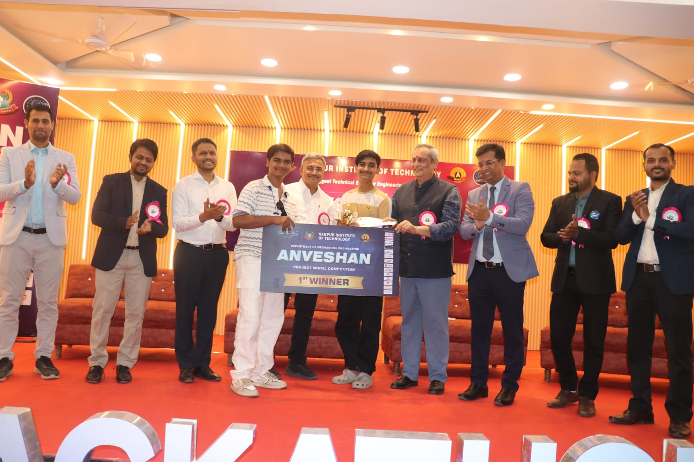
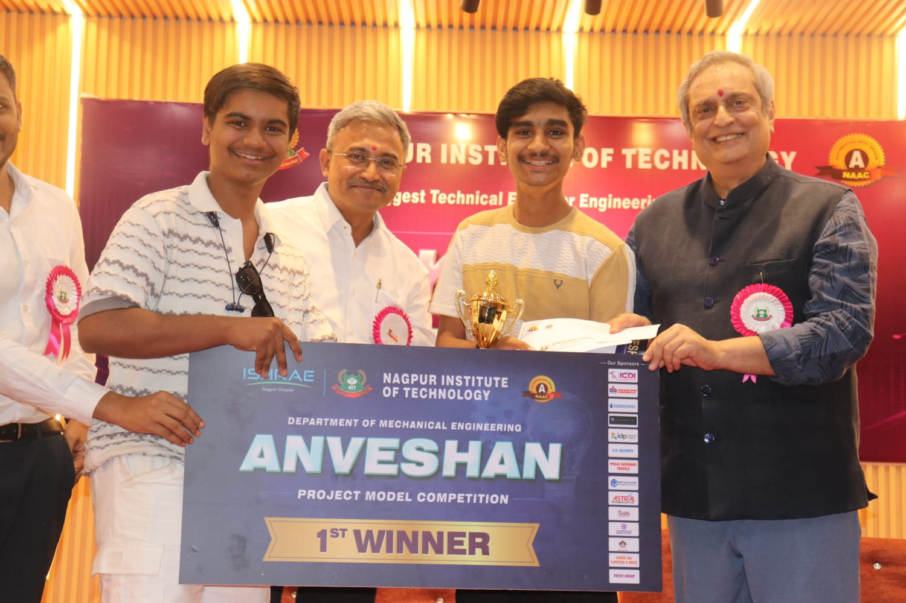
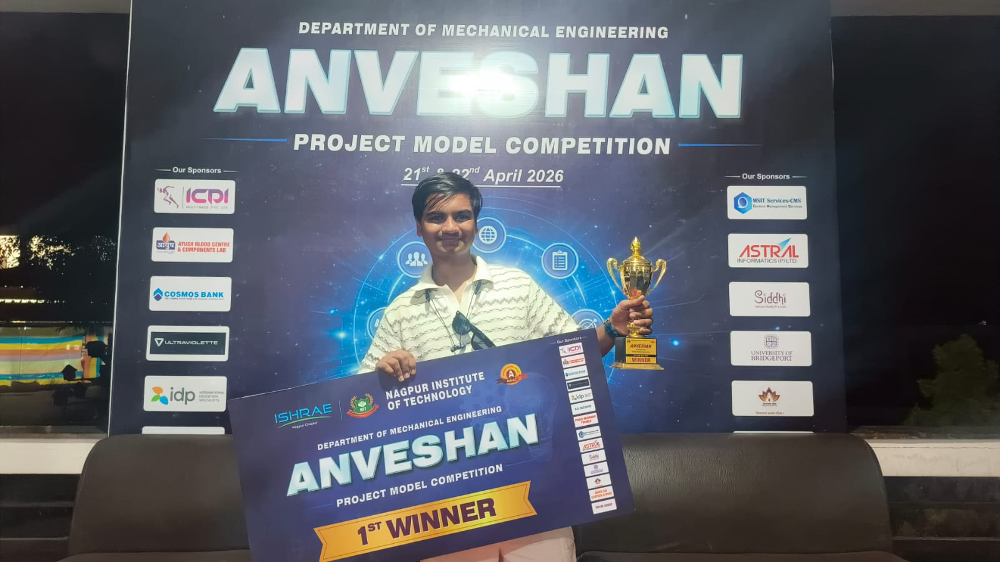
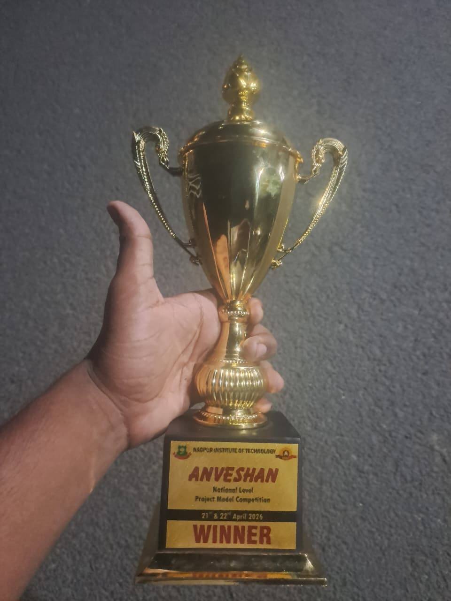
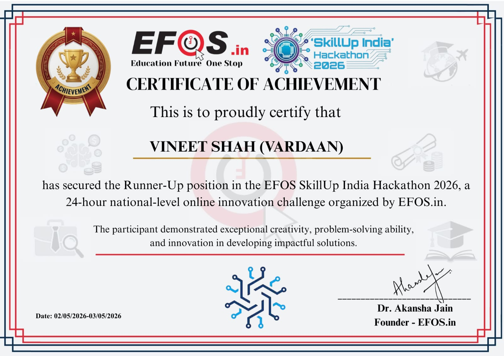

<div align="center">

# 🤖 JARVIS AI

### Intelligent Voice Assistant • Automation • AI Systems • Desktop Control

Award-winning AI-powered virtual assistant built for voice interaction, automation, and intelligent task execution.

<div align="center">

&nbsp;&nbsp;&nbsp;

## 🏆 Competition Recognition

🥇 Winner — ANVESHAN Innovation Competition  
🌍 Top 10 — EFOS National-Level Hackathon

</div>


---

&nbsp;&nbsp;&nbsp;

# 🚀 Overview

JARVIS AI is an award-winning intelligent desktop assistant system designed for voice interaction, smart automation, and AI-powered task execution.

The project combines speech recognition, automation workflows, and intelligent command processing to create a real-time assistant capable of interacting with the user naturally.

Unlike basic assistant systems, JARVIS AI focuses on:

- 🎙️ Real-time voice interaction
- ⚡ Desktop automation
- 🧠 Intelligent command execution
- 🔍 Smart task handling
- 🌐 Web integration
- 🤖 AI-based assistant workflows

The system was showcased at multiple innovation competitions and received recognition for its practical implementation and intelligent automation capabilities.

---

&nbsp;&nbsp;&nbsp;

# 🏆 Achievements & Recognition

<div align="center">

## 🥇 1st Place — ANVESHAN Project Competition

Held at Nagpur Institute of Technology (NIT Nagpur)

🏆 Winner in AI/Innovation Project Category  
💰 Prize Won: ₹3100

<br/>



<br/><br/>



<br/><br/>



<br/><br/>



<br/><br/>

&nbsp;&nbsp;&nbsp;

## 🌍 National-Level Hackathon Recognition

🏅 Top 10 Position — EFOS SkillUp India Hackathon 2026  
💰 Prize Won: ₹1100

<br/>



</div>

---

&nbsp;&nbsp;&nbsp;

# 🎥 Demonstration

<div align="center">

<video src="demo/Jarvis Showdown.mp4" controls width="90%"></video>

</div>

> Full demonstration available inside `/demo`

---

&nbsp;&nbsp;&nbsp;


# 🎥 Demonstration

<div align="center">

<video src="demo/Jarvis Showdown.mp4" controls width="90%"></video>

</div>

> Full working demonstration available inside `/demo`

---

# 📄 Project Presentation

<div align="center">

📘 Complete project documentation and architecture available in:

```text
/docs
```

</div>

---


&nbsp;&nbsp;&nbsp;


# 🧠 Core Features

<table>
<tr>
<td width="50%">

## 🎙️ Voice Intelligence

- Real-time speech recognition
- Voice-triggered commands
- Natural interaction flow
- Intelligent command parsing
- Wake-word support

</td>

<td width="50%">

## ⚡ Automation

- Desktop automation
- Browser control
- App launching
- Task execution
- Workflow automation

</td>
</tr>

<tr>
<td width="50%">

## 🌐 Smart Integrations

- Web-based queries
- Information retrieval
- Smart assistant responses
- Dynamic interaction system

</td>

<td width="50%">

## 🤖 AI System Design

- Modular architecture
- Real-time processing
- Intelligent response handling
- Expandable assistant framework

</td>
</tr>
</table>

---

&nbsp;&nbsp;&nbsp;

# 🛠️ Tech Stack

<div align="center">

| Technology | Purpose |
|---|---|
| Python | Core Development |
| SpeechRecognition | Voice Input |
| PyAudio | Audio Processing |
| OpenAI APIs | AI Interaction |
| pyttsx3 | Text-to-Speech |
| Selenium | Browser Automation |
| OpenCV | Visual Modules |
| Flask | Backend Integration |
| Automation Libraries | System Control |

</div>

---

&nbsp;&nbsp;&nbsp;

# 🧩 System Architecture

```text
User Voice Input
        │
        ▼
Speech Recognition Engine
        │
        ▼
Command Processing Layer
        │
 ┌──────┼──────┐
 ▼      ▼      ▼
Automation  AI Logic  Web Tasks
 │         │         │
 ▼         ▼         ▼
Desktop  Responses  Actions
```

---

&nbsp;&nbsp;&nbsp;

# 📂 Project Structure

```text
jarvis-ai/
│
├── achievements/
├── demo/
├── docs/
├── screenshots/
└── README.md
```

---

&nbsp;&nbsp;&nbsp;

# 📄 Documentation

Detailed workflow, architecture, implementation details, and project explanation are available inside:

```text
/docs
```

---

&nbsp;&nbsp;&nbsp;

# 🌍 Real-World Applications

- AI Virtual Assistants
- Smart Desktop Systems
- Voice-controlled Interfaces
- Productivity Automation
- Accessibility Systems
- AI Interaction Research
- Smart Personal Assistants

---

&nbsp;&nbsp;&nbsp;

# 🔒 Source Code Status

> Source code is currently private while the project is under active development and further improvements are being implemented.

---

&nbsp;&nbsp;&nbsp;

# 📌 Future Improvements

- 🧠 LLM-powered conversation system
- 📱 Mobile integration
- 🌐 Cloud synchronization
- 👁️ Computer vision modules
- 🏠 Smart home integration
- 🔊 Advanced wake-word engine
- 🤖 Personalized AI memory
- 🧩 Plugin ecosystem

---

&nbsp;&nbsp;&nbsp;

# 👨‍💻 Author

<div align="center">

## Vineet Shah

AI • Automation • Computer Vision • Full Stack Development

&nbsp;&nbsp;&nbsp;

## ⭐ If you like this project, consider starring the repository

</div>

<br/>

<a href="https://github.com/vinuah-dev">
  
</a>

<br/>

<a href="https://www.linkedin.com/in/vineet-shah-70263721a/">
  
</a>

<br/>

<a href="https://www.instagram.com/vinuah999">
  
</a>

</div>

---
<p align="center">
  
</p>
